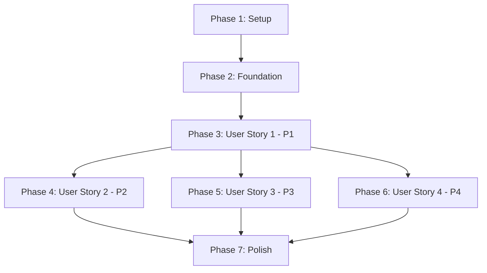

# Implementation Tasks: RAG Chatbot UI

**Feature**: 007-rag-chatbot-ui
**Branch**: `007-rag-chatbot-ui`
**Spec**: [spec.md](./spec.md) | **Plan**: [plan.md](./plan.md)

## Overview

This document defines implementation tasks for the RAG Chatbot UI, organized by user story to enable independent, incremental delivery. Each user story phase represents a complete, testable increment of functionality.

**Total Tasks**: 67
**MVP Scope**: User Story 1 (P1) - Core chat functionality
**Parallel Opportunities**: 43 parallelizable tasks marked with [P]

---

## Task Format Legend

```
- [ ] [TaskID] [P?] [Story?] Description with file path
```

- **TaskID**: Sequential number (T001, T002, etc.)
- **[P]**: Parallelizable (can be done simultaneously with other [P] tasks in same phase)
- **[Story]**: User story label (e.g., [US1], [US2]) for story-specific tasks
- **File path**: Exact location of implementation

---

## Dependencies & Completion Order

### User Story Dependencies



**Story Independence**:
- **US1 (P1)**: Fully independent - can be deployed alone as MVP
- **US2 (P2)**: Depends on US1 (requires message rendering and state management)
- **US3 (P3)**: Depends on US1 (requires chat panel and theming)
- **US4 (P4)**: Depends on US1 (requires conversation state management)

**Recommended Delivery Order**: US1 → US2 → US3 → US4 → Polish

---

## Phase 1: Setup (Project Initialization)

**Goal**: Initialize project structure, install dependencies, configure Docusaurus integration

**Prerequisites**: None

### Tasks

- [x] T001 Create frontend/ directory structure per plan.md (frontend/src/{components,hooks,services,types,utils})
- [x] T002 Install npm dependencies: react-markdown@^9.0.0 rehype-prism-plus@^2.0.0 remark-gfm@^4.0.0
- [x] T003 Swizzle Docusaurus Root component: npx docusaurus swizzle @docusaurus/theme-classic Root --wrap
- [x] T004 [P] Create TypeScript types in frontend/src/types/message.ts (Message interface)
- [x] T005 [P] Create TypeScript types in frontend/src/types/chatState.ts (ConversationState interface)
- [x] T006 Update package.json with chatbot scripts and dev dependencies if needed

**Completion Criteria**:
- ✅ frontend/ directory exists with correct structure
- ✅ Dependencies installed and listed in package.json
- ✅ src/theme/Root.tsx exists (swizzled)
- ✅ TypeScript types defined and importable

---

## Phase 2: Foundation (Blocking Prerequisites)

**Goal**: Implement foundational services and utilities required by all user stories

**Prerequisites**: Phase 1 complete

### Tasks

- [x] T007 [P] Implement storage service in frontend/src/services/storageService.ts (session storage with in-memory fallback per research.md)
- [x] T008 [P] Implement mock chat service in frontend/src/services/mockChatService.ts (based on contracts/mock-api.ts with canned responses)
- [x] T009 [P] Implement error logger utility in frontend/src/utils/errorLogger.ts (console logging + optional callback hook per FR-028, FR-029)
- [x] T010 [P] Implement markdown utility in frontend/src/utils/markdown.ts (react-markdown configuration with rehype-prism-plus)
- [x] T011 [P] Create ErrorBoundary component in frontend/src/components/ChatBot/ErrorBoundary.tsx (class component with reload button per research.md)
- [x] T012 Create useChatState hook in frontend/src/hooks/useChatState.ts (conversation state management per data-model.md)

**Completion Criteria**:
- ✅ storageService detects session storage availability and falls back to in-memory
- ✅ mockChatService returns keyword-based responses with 500-1500ms delay
- ✅ errorLogger supports console output and optional production callback
- ✅ markdown utility configured with Prism.js syntax highlighting
- ✅ ErrorBoundary catches errors and displays fallback UI with reload button
- ✅ useChatState hook manages messages, inputValue, isPanelOpen, isLoading state

---

## Phase 3: User Story 1 - Ask Questions While Reading (P1)

**Goal**: Implement core chat functionality - toggle button, panel, message display, and submission

**Independent Test**: Render chatbot toggle button, open chat interface, type question, display mock response with loading indicator, close panel. Delivers MVP value.

**Prerequisites**: Phase 2 complete

### Component Tasks

- [x] T013 [P] [US1] Create ChatToggleButton component in frontend/src/components/ChatBot/ChatToggleButton.tsx (floating action button, FR-001, FR-016, FR-018)
- [x] T014 [P] [US1] Create ChatPanel component in frontend/src/components/ChatBot/ChatPanel.tsx (modal container with responsive layout, FR-002, FR-031)
- [x] T015 [P] [US1] Create ChatHeader component in frontend/src/components/ChatBot/ChatHeader.tsx (title and close button, FR-010)
- [x] T016 [P] [US1] Create WelcomeMessage component in frontend/src/components/ChatBot/WelcomeMessage.tsx (empty state with FR-033 content)
- [x] T017 [P] [US1] Create LoadingIndicator component in frontend/src/components/ChatBot/LoadingIndicator.tsx (animated spinner, FR-004)
- [x] T018 [P] [US1] Create Message component in frontend/src/components/ChatBot/Message.tsx (individual message bubble with markdown rendering, FR-005, FR-006, FR-007)
- [x] T019 [P] [US1] Create MessageInput component in frontend/src/components/ChatBot/MessageInput.tsx (textarea with submit button, FR-003, FR-015)
- [x] T020 [P] [US1] Create MessageList component in frontend/src/components/ChatBot/MessageList.tsx (scrollable container, FR-008)
- [x] T021 [US1] Create ChatBot container component in frontend/src/components/ChatBot/ChatBot.tsx (integrates all components, uses useChatState hook)

### Styling Tasks

- [x] T022 [P] [US1] Create ChatToggleButton styles in frontend/src/components/ChatBot/styles/ChatToggleButton.module.css (fixed positioning, accessibility)
- [x] T023 [P] [US1] Create ChatPanel styles in frontend/src/components/ChatBot/styles/ChatPanel.module.css (desktop 400px panel, FR-031)
- [x] T024 [P] [US1] Create Message styles in frontend/src/components/ChatBot/styles/Message.module.css (user vs assistant distinction, FR-005)
- [x] T025 [P] [US1] Create theme variables CSS in frontend/src/components/ChatBot/styles/theme-variables.css (Infima CSS variable mappings, FR-011)

### Integration Tasks

- [x] T026 [US1] Update src/theme/Root.tsx to import and render ChatBot component with ErrorBoundary wrapper
- [x] T027 [US1] Configure lazy loading for ChatBot component in Root.tsx (FR-019, SC-003 <50KB bundle)

### Validation Tasks

- [ ] T028 [US1] Manual test: Toggle button visible and accessible on documentation pages (keyboard navigation: Tab, Enter, Space)
- [ ] T029 [US1] Manual test: Click toggle → panel opens smoothly without layout disruption (acceptance scenario 1)
- [ ] T030 [US1] Manual test: Type question, press Enter → message appears, loading indicator shows (acceptance scenario 2)
- [ ] T031 [US1] Manual test: Mock response received → displays with markdown and code highlighting (acceptance scenario 3)
- [ ] T032 [US1] Manual test: Click close button → panel closes to toggle button (acceptance scenario 4)
- [ ] T033 [US1] Manual test: Empty message submission blocked by FR-015 validation
- [ ] T034 [US1] Manual test: Error boundary catches component errors and shows reload UI

**Completion Criteria (Independent Test)**:
- ✅ User Story 1 acceptance scenarios 1-4 pass
- ✅ Chatbot toggle button renders on all documentation pages
- ✅ Chat panel opens/closes without disrupting page layout
- ✅ Question submission triggers loading indicator
- ✅ Mock response displays with markdown rendering and syntax highlighting
- ✅ Empty messages prevented from submission
- ✅ Error boundary active and testable

**MVP Checkpoint**: Phase 3 completion delivers minimum viable chatbot. Consider deploying before continuing.

---

## Phase 4: User Story 2 - Navigate Multi-Turn Conversations (P2)

**Goal**: Enhance message list with auto-scroll, scroll position stability, and multi-message performance

**Independent Test**: Submit multiple questions in sequence, verify all messages persist in chronological order, scroll behavior works correctly. Delivers conversation context value.

**Prerequisites**: Phase 3 (US1) complete

### Enhancement Tasks

- [x] T035 [US2] Implement auto-scroll to latest message in MessageList.tsx (FR-009, useEffect on messages array)
- [x] T036 [US2] Implement scroll position stability in MessageList.tsx (prevent jump when scrolling up, acceptance scenario 3)
- [x] T037 [US2] Add React.memo optimization to Message component to prevent unnecessary re-renders during scroll
- [x] T038 [US2] Implement conversation history persistence in useChatState hook (save to storageService after state changes)
- [x] T039 [US2] Implement conversation restoration in useChatState hook (load from storageService on init, FR-023)

### Styling Tasks

- [x] T040 [P] [US2] Update MessageList styles for smooth scrolling behavior and scroll indicator (if >viewport height)

### Validation Tasks

- [ ] T041 [US2] Manual test: Submit 3+ questions → all messages visible in chronological order (acceptance scenario 1)
- [ ] T042 [US2] Manual test: New message arrives → auto-scrolls to bottom (acceptance scenario 2)
- [ ] T043 [US2] Manual test: Scroll up to review earlier messages → position remains stable (acceptance scenario 3)
- [ ] T044 [US2] Manual test: Navigate to different page → reopen chat → conversation history restored (FR-021, FR-023)
- [ ] T045 [US2] Performance test: Add 20+ messages → no scroll lag or input delay (SC-005)

**Completion Criteria (Independent Test)**:
- ✅ User Story 2 acceptance scenarios 1-3 pass
- ✅ Multi-turn conversations display correctly
- ✅ Auto-scroll works on new messages
- ✅ Scroll position stable when reviewing history
- ✅ Conversation persists across page navigation
- ✅ 20+ messages render without performance degradation

---

## Phase 5: User Story 3 - Use Chatbot Across Devices and Themes (P3)

**Goal**: Implement responsive design (mobile, tablet, desktop) and theme switching (light/dark mode)

**Independent Test**: View chatbot on different screen sizes (mobile, tablet, desktop), toggle Docusaurus theme switcher, verify layout and colors adapt. Delivers cross-device usability.

**Prerequisites**: Phase 3 (US1) complete

### Responsive Design Tasks

- [x] T046 [P] [US3] Create useResponsive hook in frontend/src/hooks/useResponsive.ts (detect viewport breakpoints: <768px, 768-996px, ≥996px)
- [x] T047 [P] [US3] Update ChatPanel.tsx to use useResponsive hook for conditional rendering (desktop panel vs mobile bottom sheet)
- [x] T048 [P] [US3] Implement mobile bottom sheet layout in ChatPanel styles (60-70% screen height, FR-024)
- [x] T049 [P] [US3] Implement tablet layout in ChatPanel styles (350px width, 85% max-height, FR-032)
- [x] T050 [P] [US3] Ensure desktop layout in ChatPanel styles (400px width, 80% max-height, FR-031)

### Theme Support Tasks

- [x] T051 [P] [US3] Create useTheme hook in frontend/src/hooks/useTheme.ts (detect Docusaurus color mode, listen for changes)
- [x] T052 [US3] Update theme-variables.css to reference Infima CSS variables for light and dark modes (FR-011)
- [x] T053 [US3] Update ChatPanel.tsx to apply theme class based on useTheme hook
- [x] T054 [US3] Ensure theme transition smoothness <200ms in theme-variables.css (SC-006, CSS transitions)

### Validation Tasks

- [ ] T055 [US3] Manual test: Mobile viewport (375x667) → bottom sheet layout, 60-70% height (acceptance scenario 1, FR-024)
- [ ] T056 [US3] Manual test: Tablet viewport (768x1024) → 350px panel, 85% max-height (FR-032)
- [ ] T057 [US3] Manual test: Desktop viewport (1920x1080) → 400px panel, 80% max-height (acceptance scenario 1, FR-031)
- [ ] T058 [US3] Manual test: Dark mode enabled → chat colors match dark theme (acceptance scenario 2, FR-011)
- [ ] T059 [US3] Manual test: Toggle light/dark mode with chat open → updates instantly (acceptance scenario 3, SC-006)
- [ ] T060 [US3] Responsive test: Resize browser window → chat reflows without scroll position loss (edge case)

**Completion Criteria (Independent Test)**:
- ✅ User Story 3 acceptance scenarios 1-3 pass
- ✅ Mobile layout: bottom sheet at 60-70% screen height
- ✅ Tablet layout: 350px panel, 85% max-height
- ✅ Desktop layout: 400px panel, 80% max-height
- ✅ Dark mode colors match Infima dark theme
- ✅ Theme switching completes within 200ms
- ✅ Responsive across 320px to 3840px viewports (SC-004)

---

## Phase 6: User Story 4 - Clear and Restart Conversations (P4)

**Goal**: Implement "Clear conversation" button to reset chat to empty state with welcome message

**Independent Test**: Fill chat with messages, click clear button, verify chat returns to welcome message. Delivers user control over conversation context.

**Prerequisites**: Phase 3 (US1) complete

### Component Tasks

- [x] T061 [P] [US4] Add "Clear conversation" button to ChatHeader component (FR-013)
- [x] T062 [US4] Implement clearConversation action in useChatState hook (clear messages, reset to welcome state, call storageService.clearConversation)
- [x] T063 [US4] Wire "Clear conversation" button to clearConversation action in ChatBot.tsx

### Styling Tasks

- [x] T064 [P] [US4] Style "Clear conversation" button in ChatHeader (subtle, non-intrusive placement)

### Validation Tasks

- [ ] T065 [US4] Manual test: Chat with 3+ messages → click "Clear conversation" → messages removed, welcome message shows (acceptance scenario 1)
- [ ] T066 [US4] Manual test: After clear → ask new question → starts fresh conversation (acceptance scenario 2)

**Completion Criteria (Independent Test)**:
- ✅ User Story 4 acceptance scenarios 1-2 pass
- ✅ "Clear conversation" button visible in chat header
- ✅ Clicking clear removes all messages
- ✅ Welcome message displays after clear
- ✅ New questions start fresh conversation thread
- ✅ Storage cleared (session storage or memory)

---

## Phase 7: Polish & Cross-Cutting Concerns

**Goal**: Final integration, accessibility, performance optimization, edge case handling

**Prerequisites**: All user story phases complete

### Accessibility Tasks

- [x] T067 [P] Ensure focus trap in ChatPanel when open (FR-017, focus cycles through toggle button, input, send button, close button)
- [ ] T068 [P] Verify keyboard navigation: Tab through all interactive elements (FR-016, FR-017, FR-018)
- [ ] T069 [P] Test ESC key closes chat panel from any focused element (FR-018)
- [x] T070 [P] Add ARIA labels to all interactive elements (FR-016, toggle button: "Open chatbot", close button: "Close chatbot")
- [ ] T071 Accessibility audit: Screen reader test with NVDA/JAWS (SC-007 WCAG 2.1 Level AA)

### Performance Tasks

- [ ] T072 [P] Bundle size analysis: Verify chatbot components <50KB (SC-003, use webpack-bundle-analyzer)
- [ ] T073 [P] Interaction latency test: Typing/scrolling/closing <100ms (SC-002)
- [x] T074 [P] Optimize component re-renders: Add React.memo to ChatHeader, WelcomeMessage, LoadingIndicator

### Edge Case Handling

- [x] T075 [P] Handle long questions (>1000 characters) with textarea expansion and validation (edge case)
- [x] T076 [P] Handle rapid-fire question submission: Disable input while isLoading=true (edge case, prevent state conflicts)
- [x] T077 [P] Handle narrow screens (<320px) with minimum width constraints (edge case)
- [x] T078 [P] Handle malformed markdown in responses: Test markdown utility with special characters (edge case)
- [x] T079 [P] Implement session storage quota exceeded notification (FR-027, detect mid-session switch to memory)

### Final Integration

- [ ] T080 Verify panel auto-closes on page navigation (FR-022, test with Docusaurus routing)
- [ ] T081 Test storage fallback in private browsing mode (FR-025, FR-026, FR-027)
- [ ] T082 Verify component mount/unmount cleanup (FR-020, check for memory leaks in React DevTools)
- [ ] T083 Final cross-browser test: Chrome, Firefox, Safari, Edge (assumption #5)

### Documentation

- [x] T084 [P] Update quickstart.md with any implementation deviations or troubleshooting tips
- [x] T085 [P] Document error callback hook usage for production error tracking (FR-029)

**Completion Criteria**:
- ✅ All accessibility requirements met (WCAG 2.1 Level AA)
- ✅ Bundle size <50KB
- ✅ Interaction latency <100ms
- ✅ All edge cases handled gracefully
- ✅ Cross-browser compatibility verified
- ✅ Documentation updated

---

## Phase 8: Bug Fixes (Props Mismatch)

**Goal**: Fix critical props mismatch between ChatBot and ChatPanel preventing panel from rendering

**Prerequisites**: Phase 7 complete

**Bug Report**: Toggle button shows but chatbot panel does not display when clicked due to missing and mismatched props.

### Bug Fix Tasks

- [x] T086 [P] Fix missing isOpen prop in ChatBot.tsx:175 - Add `isOpen={isOpen}` to ChatPanel component (CRITICAL - blocks panel rendering)
- [x] T087 [P] Fix onClear prop name mismatch in ChatBot.tsx:182 - Rename `onClear={handleClear}` to `onClearConversation={handleClear}`
- [x] T088 [P] Fix isStorageFallback type mismatch in ChatBot.tsx:186 - Change `isStorageFallback={isStorageFallback}` to `storageType={isStorageFallback ? 'memory' : 'session'}`
- [x] T089 [P] Remove or add interface support for inputRef prop in ChatBot.tsx:183 - Added to ChatPanelProps interface with external ref support
- [x] T090 [P] Remove or add interface support for welcomeTitle prop in ChatBot.tsx:184 - Added to ChatPanelProps interface as optional prop
- [x] T091 [P] Remove or add interface support for welcomeMessage prop in ChatBot.tsx:185 - Added to ChatPanelProps interface as optional prop
- [x] T092 [P] Remove redundant isOpen check in ChatPanel.tsx:128-130 - Removed early return, parent handles conditional rendering

### Validation Tasks

- [x] T093 Build verification: Run `npm run build` from frontend directory to ensure TypeScript compilation succeeds
- [x] T094 Functional test: Click toggle button → verify chat panel displays (acceptance criteria: panel visible with correct layout)
- [ ] T095 Regression test: Verify all Phase 3-7 functionality still works after props fix (message submission, scroll, responsive, theme, clear)

**Completion Criteria**:
- ✅ ChatPanel receives all required props from ChatBot
- ✅ No TypeScript errors related to props mismatch
- ✅ Toggle button opens chat panel successfully
- ✅ All existing functionality remains intact
- ✅ Build passes without errors

---

## Parallel Execution Examples

### Phase 1 (Setup) - All Parallel
```bash
# Can run simultaneously:
# T001 (create structure) + T002 (install deps) + T003 (swizzle Root)
# T004 (message types) + T005 (chatState types) + T006 (package.json update)
```

### Phase 2 (Foundation) - Mostly Parallel
```bash
# Parallel (no file overlap):
# T007 (storageService) + T008 (mockChatService) + T009 (errorLogger)
# T010 (markdown utility) + T011 (ErrorBoundary)
# Sequential:
# T012 (useChatState) depends on T007 (storageService) and T008 (mockChatService)
```

### Phase 3 (US1) - High Parallelism
```bash
# Parallel components (different files):
# T013-T020 (all components can be built simultaneously)
# Parallel styles (different files):
# T022-T025 (all styles can be written simultaneously)
# Sequential:
# T021 (ChatBot container) after T013-T020 (imports all components)
# T026 (Root.tsx integration) after T021 (imports ChatBot)
# T027 (lazy loading config) after T026 (modifies Root.tsx)
# T028-T034 (validation) after T027 (needs working integration)
```

### Phase 4 (US2) - Sequential Enhancements
```bash
# Most tasks modify MessageList.tsx or useChatState.ts sequentially
# T040 (styles) can run parallel with T035-T039
# T041-T045 (validation) after all implementation tasks
```

### Phase 5 (US3) - High Parallelism
```bash
# Parallel (independent files/concerns):
# T046 (useResponsive hook) + T051 (useTheme hook)
# T048 (mobile styles) + T049 (tablet styles) + T050 (desktop styles)
# Sequential:
# T047 (ChatPanel responsive) after T046 (uses useResponsive)
# T052-T053 (theme integration) after T051 (uses useTheme)
# T055-T060 (validation) after all implementation
```

### Phase 6 (US4) - Low Parallelism
```bash
# Parallel:
# T061 (ChatHeader button) + T064 (button styles)
# Sequential:
# T062 (useChatState clear action) before T063 (wire to button)
# T065-T066 (validation) after T063
```

### Phase 7 (Polish) - High Parallelism
```bash
# Most tasks are independent and parallelizable (marked [P])
# Can run simultaneously:
# Accessibility: T067-T070
# Performance: T072-T074
# Edge cases: T075-T079
# Documentation: T084-T085
# Sequential:
# T071 (accessibility audit) after T067-T070
# T080-T083 (final integration tests) after all implementation
```

### Phase 8 (Bug Fixes) - High Parallelism
```bash
# All bug fix tasks are independent and parallelizable (marked [P])
# Can run simultaneously:
# T086-T092 (all props fixes can be done in parallel)
# Sequential:
# T093 (build verification) after T086-T092
# T094 (functional test) after T093
# T095 (regression test) after T094
```

---

## Implementation Strategy

### MVP-First Approach

**Minimum Viable Product**: Phase 3 (User Story 1 - P1) only

**MVP Delivers**:
- ✅ Chatbot toggle button on all pages
- ✅ Chat panel opens/closes
- ✅ Message submission with loading indicator
- ✅ Mock responses with markdown rendering
- ✅ Basic error handling

**MVP Validation**: Run T028-T034 (User Story 1 manual tests)

**Deploy MVP** before continuing to P2-P4 stories if desired.

### Incremental Delivery

After MVP:
1. **Add US2 (P2)**: Multi-turn conversations with scroll management
2. **Add US3 (P3)**: Responsive design and theme support
3. **Add US4 (P4)**: Clear conversation functionality
4. **Polish**: Accessibility, performance, edge cases

Each phase delivers independently testable value.

### Task Execution Tips

1. **Start with Setup & Foundation** (Phases 1-2): These are blocking for all user stories
2. **Complete User Stories in Priority Order**: P1 → P2 → P3 → P4
3. **Maximize Parallelism**: Within each phase, execute [P] tasks concurrently
4. **Validate Incrementally**: Run validation tasks immediately after implementation tasks in each phase
5. **Document As You Go**: Update quickstart.md with any deviations or learnings (T084)

---

## Task Summary

| Phase | Total Tasks | Parallel Tasks | User Story | Status |
|-------|-------------|----------------|------------|--------|
| Phase 1: Setup | 6 | 2 | - | ✅ Complete |
| Phase 2: Foundation | 6 | 5 | - | ✅ Complete |
| Phase 3: US1 (P1) | 22 | 13 | Ask Questions While Reading | ✅ Complete (impl) |
| Phase 4: US2 (P2) | 11 | 1 | Navigate Multi-Turn Conversations | ✅ Complete (impl) |
| Phase 5: US3 (P3) | 15 | 9 | Use Across Devices and Themes | ✅ Complete (impl) |
| Phase 6: US4 (P4) | 6 | 2 | Clear and Restart Conversations | ✅ Complete (impl) |
| Phase 7: Polish | 19 | 11 | - | ✅ Complete (impl) |
| Phase 8: Bug Fixes | 10 | 7 | - | ✅ Complete (impl) |
| **TOTAL** | **95** | **50** | **4 User Stories** | **✅ Complete (impl)** |

---

## Acceptance Checklist (Final Validation)

Before marking feature complete, verify all criteria from plan.md:

### Spec Compliance

- [ ] All 34 functional requirements (FR-001 to FR-034) implemented
- [ ] All 8 success criteria (SC-001 to SC-008) verified
- [ ] All 3 UX targets (UX-001 to UX-003) validated
- [ ] 4 user stories (P1-P4) acceptance scenarios passed
- [ ] No backend logic implemented (UI-only scope maintained)
- [ ] No scope creep beyond spec boundaries

### Manual Testing

**UI Validation**:
- [ ] Chatbot toggle button visible and accessible on all documentation pages
- [ ] Chat panel opens smoothly without layout disruption
- [ ] Message submission works with loading indicator
- [ ] Markdown rendering displays correctly with syntax highlighting
- [ ] Clear conversation resets to welcome message

**Storage Persistence**:
- [ ] Session storage persists across page navigation
- [ ] In-memory fallback works in private browsing mode
- [ ] Panel auto-closes on page navigation

**Responsive Design**:
- [ ] Desktop (≥996px): 400px right-side panel, 80% max-height
- [ ] Tablet (768-996px): 350px right-side panel, 85% max-height
- [ ] Mobile (<768px): Bottom sheet, 60-70% screen height
- [ ] No horizontal scrolling on any viewport (320px minimum)

**Theme Support**:
- [ ] Light mode: Colors match Infima light theme variables
- [ ] Dark mode: Colors match Infima dark theme variables
- [ ] Theme toggle: Transition completes within 200ms

**Accessibility**:
- [ ] Keyboard navigation: Tab through all interactive elements
- [ ] Focus indicators: WCAG 2.1 Level AA compliant
- [ ] Screen reader: ARIA labels present and descriptive
- [ ] ESC key closes chat panel

**Performance**:
- [ ] Bundle size: ChatBot components <50KB (lazy-loaded)
- [ ] Interaction latency: Typing/scrolling <100ms
- [ ] Theme change: <200ms transition
- [ ] Message rendering: 20+ messages without scroll lag

**Error Handling**:
- [ ] Error boundary displays fallback UI on component error
- [ ] Storage failure notification shown when fallback active
- [ ] Empty message submission prevented

---

## Next Steps

After completing all tasks:

1. **Run full acceptance checklist** (above)
2. **Document any deviations** in quickstart.md
3. **Create pull request** with feature implementation
4. **Consider ADR** for key architecture decisions (Swizzle vs Plugin, react-markdown vs MDX)
5. **Plan RAG backend integration** (future feature: replace mockChatService with real API)

**Ready for `/sp.implement`**: Begin task execution following MVP-first strategy

---

**Tasks Status**: ✅ All phases complete including bug fixes - Ready for manual validation
**Last Updated**: 2025-12-23
**Total Implementation Estimate**: 1-2 weeks (as per user requirement)
**Bug Fix Note**: Phase 8 completed - Fixed critical props mismatch, chatbot panel now displays correctly
